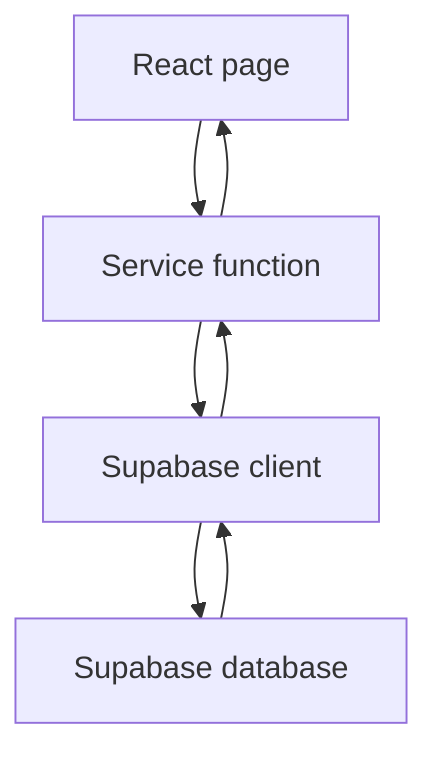

# App Notes

These notes explain the app in a way that is useful for learning, refactoring,
and preparing to talk about the project in interviews.

## Product Summary

EigoPath is an English learning app. The core user journey is:

1. The user opens the app and chooses grammar, vocabulary, practice, or search.
2. The user studies content by level and topic.
3. The user signs in to save vocabulary words.
4. Saved words appear in My Dictionary.
5. The user reviews saved words with quiz-style questions.
6. Review results are stored so progress can be shown later.

When explaining the app, focus on that journey first. The code matters because
it supports this journey.

## What Kind of Screenshots to Attach

Attach screenshots that show states, not just pages. A state means "what is
happening in the app right now."

Good screenshots:

- Home page: shows branding and the purpose of the app.
- Vocabulary page: shows real learning content.
- Saved word state: shows that a user can save a word.
- My Dictionary: shows personalized data.
- Review question: shows the quiz experience before checking.
- Review feedback: shows what happens after checking.
- Result card: shows score formatting and completion.
- Mobile menu: shows responsive design and accessibility care.

Less useful screenshots:

- Empty pages.
- Only the hero image.
- Several screenshots that all show the same kind of card.
- Cropped UI where the main action is not visible.

For a portfolio, each screenshot should answer one question: "What can the user
do here?"

## Important Architecture Ideas

### Pages

Pages are route-level screens. A page usually answers: "What should appear for
this URL?"

Examples:

- `src/pages/Vocabulary.tsx`
- `src/pages/MyDictionary.tsx`
- `src/pages/VocabularyPracticeSession.tsx`

Pages often connect several things together: data, route params, hooks, and
components.

### Components

Components are reusable UI pieces. A component should usually answer: "How
should this piece of interface look and behave?"

Examples:

- `src/components/Button.tsx`
- `src/components/QuizProgress.tsx`
- `src/components/QuizResultCard.tsx`
- `src/components/VocabularyWordCard.tsx`

The goal is to avoid copying the same UI pattern across many pages.

### Hooks

Hooks hold reusable React state logic.

Example:

```ts
const {
  checked,
  checkAnswer,
  currentQuestion,
  goNext,
  progressPercent,
  reset,
  score,
} = useQuizSession(questions);
```

This lets quiz pages share the same ideas:

- current question index
- score
- checked/not checked state
- next question behavior
- reset behavior
- result state

The page still controls the page-specific answer, such as selected option,
typed input, or selected reorder tokens.

### Services

Services are functions that talk to Supabase.

Example:

```ts
const savedWords = await getSavedWords(user.id);
```

This is better than writing Supabase queries directly inside every component
because:

- Components stay easier to read.
- Database code has one clear home.
- Tests can focus on data behavior.
- If the table changes, fewer files need edits.

### Types

`src/types/database.types.ts` describes the shape of Supabase data. It helps
TypeScript catch mistakes before the app runs.

Example:

```ts
export type SavedWord = Database["public"]["Tables"]["saved_words"]["Row"];
```

That means: "Use the Row type from the saved_words table and call it
SavedWord."

## Route-Level Logic

Route-level logic means logic that belongs to a whole page or URL.

For example, this is route-level logic:

- Reading `topicId` from the URL.
- Deciding what to show if the URL has an invalid topic.
- Loading saved words for the current user.
- Redirecting unauthenticated users away from protected pages.
- Choosing which quiz question set belongs to this route.

This is not usually route-level logic:

- How one button looks.
- How a progress bar calculates ARIA attributes.
- How to normalize an answer string.
- How to render one vocabulary word card.

A good rule:

```text
If the logic depends on the current page or URL, it probably belongs in a page.
If the logic can be reused by many pages, move it into a component, hook, util,
or service.
```

## Quiz Logic

Quiz behavior is shared through `useQuizSession`.

The hook owns:

- which question the user is on
- whether the current question has been checked
- the score
- whether the quiz is finished
- how far through the quiz the user is

The page owns:

- the selected multiple-choice answer
- the typed answer
- the selected reorder tokens
- the rule for deciding whether the answer is correct

This separation matters because "quiz session state" is shared, but "answer
input state" changes by question type.

## Shared Quiz Utilities

`normalizeAnswer` makes text comparison more forgiving.

Example:

```ts
normalizeAnswer("  Hello, World!  ");
// "hello world"
```

This is useful because users may type extra spaces, uppercase letters, or simple
punctuation.

`shuffleArray` creates a shuffled copy of an array.

Example:

```ts
const original = ["A", "B", "C"];
const shuffled = shuffleArray(original);
```

The original array is not changed. That is important in React because mutating
existing arrays can cause confusing bugs.

`createQuestionSet` shuffles questions and takes a smaller number.

Example:

```ts
const questions = createQuestionSet(allQuestions, 3);
```

That means: "Randomize all questions, then keep only 3."

## Supabase Data Flow

The app uses Supabase for authentication and user data.

The flow looks like this:



Example:

1. `MyDictionary.tsx` asks for saved words.
2. `getSavedWords(user.id)` runs the Supabase query.
3. Supabase returns rows from `saved_words`.
4. The page renders the result.

This is cleaner than putting every Supabase query directly in the page.

## Testing Levels

There are different levels of tests.

### Unit Tests

Unit tests check a small piece of logic.

Example:

```ts
expect(normalizeAnswer(" Hello! ")).toBe("hello");
```

This test does not care about React, pages, or the browser. It checks one
function.

### Component Tests

Component tests check rendered UI behavior.

Example:

```ts
render(<Button variant="primary">Save</Button>);
expect(screen.getByRole("button", { name: "Save" })).toBeInTheDocument();
```

This checks that the component renders in a way a user and screen reader can
find.

### Hook Tests

Hook tests check reusable React state logic.

Example:

```ts
const { result } = renderHook(() => useQuizSession(["one", "two"]));
```

This lets the test call hook functions and check state changes.

### User-Flow Tests

User-flow tests check a complete user path.

Example flow:

1. User logs in.
2. User opens a vocabulary page.
3. User saves a word.
4. User opens My Dictionary.
5. User starts review.
6. User answers questions.
7. User sees the result.

These tests are more realistic, but they also take more setup. For this app, a
good next testing goal is one user-flow test for saved words and one user-flow
test for quiz completion.

## Hero Image Optimization

The current hero image is `src/assets/newHero.png`, and it is around 1.5 MB.
That is large for a first-screen image.

Better practice:

- Use the smallest image dimensions that still look sharp.
- Convert PNG to WebP or AVIF for smaller file size.
- Keep a PNG fallback only if needed.
- Use explicit width and height or stable CSS sizing to reduce layout shift.
- Avoid lazy-loading the main hero image when it appears above the fold.
- Use lazy loading for images lower on the page.

Example future pattern:

```tsx
<picture>
  <source srcSet="/images/hero.avif" type="image/avif" />
  <source srcSet="/images/hero.webp" type="image/webp" />
  
</picture>
```

The idea is not "always use the newest format." The idea is: give modern
browsers a smaller file while keeping a fallback if needed.

## Browserslist Warning

Browserslist is a tool that helps frontend tools understand which browsers your
project should support.

Build tools use it to answer questions like:

- Do we need to add CSS prefixes?
- Do we need to transform modern JavaScript?
- Which browser features are safe to use?

The warning about `caniuse-lite` means the local browser data is old. It does
not usually mean the app is broken.

The fix is:

```bash
npx update-browserslist-db@latest
```

That command refreshes the browser support database in your lockfile. It needs
network access, so it is something to run intentionally when you are doing
dependency maintenance.

## How to Explain This Project

A short interview-style explanation:

```text
EigoPath is a React and TypeScript English learning app. I built grammar and
vocabulary routes, Supabase authentication, a personal dictionary, and quiz
review sessions. During refactoring, I separated reusable quiz state into a
custom hook, moved Supabase access into service functions, added database types,
created shared UI components, and added tests for important behavior.
```

Then mention what you improved:

- Removed duplicated quiz logic.
- Fixed answer checking so users cannot change answers after checking.
- Improved accessibility in menus and progress bars.
- Added typed Supabase service functions.
- Added automated tests.
- Started documenting setup and architecture.

## What to Practice Next

- Reading React component props and destructuring.
- Understanding custom hooks and when to create one.
- Writing small utility functions and testing them.
- Separating UI code from data access code.
- Reading TypeScript generic syntax like `<T>`.
- Writing accessible buttons, menus, forms, and progress bars.
- Explaining tradeoffs, not only code syntax.
